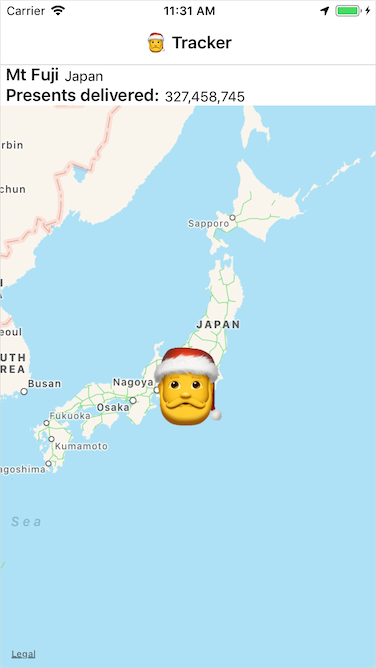

# Fabulous Santa Tracker

🎅

A [Fabulous](https://fsprojects.github.io/Fabulous/guide.html) app to track where Santa is as he flies around the world delivering presents on Christmas Eve to all the good children of the world.

You can read the blog post on this at https://jimbobbennett.io/fabulous-santa-tracker.

#### Using this code

This code will compile and run on both Android and iOS in Visual Studio on Windows and Mac.

For iOS the app will run on a simulator without any tweaks. To run on a device you will need to sign with your provisioning profile.
For Android you will need a Google Maps key. The [docs here](https://docs.microsoft.com/xamarin/android/platform/maps-and-location/maps/obtaining-a-google-maps-api-key?WT.mc_id=maps-blog-jabenn) explain how to set this up.